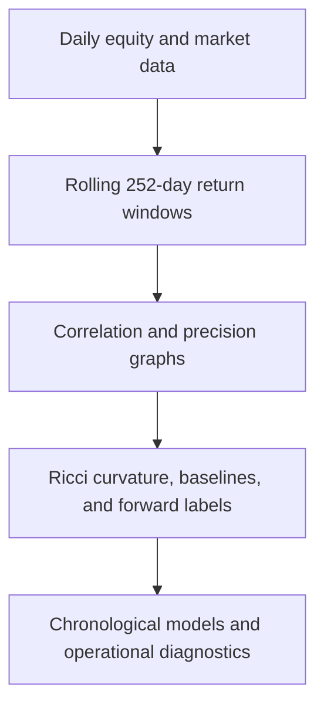
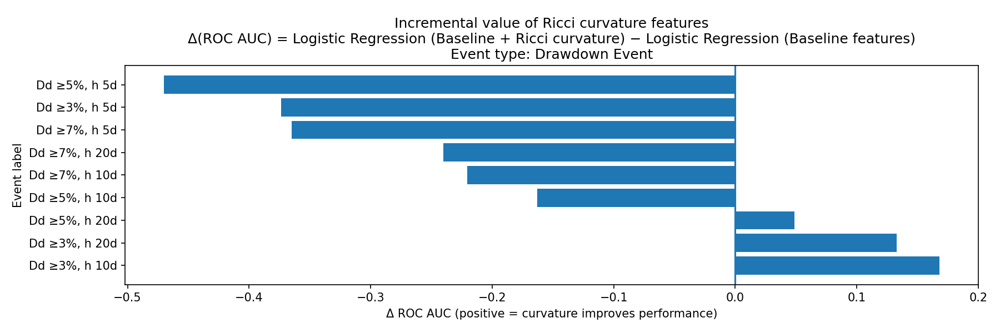

# Curvature Before the Crash

## Discrete Ricci Geometry for Early Warning in Financial Networks

This research project tests whether changes in the geometry of rolling S&P 500 equity networks can provide interpretable early-warning signals for market stress.

The pipeline builds shrinkage-correlation and sparse precision networks from rolling stock-return windows, computes Ollivier-Ricci and Forman-Ricci curvature, and tests whether curvature-derived features improve forecasts of rare volatility and drawdown events beyond conventional market and network baselines.

The central finding is deliberately nuanced: **curvature is informative in selected drawdown settings, but it is not a universal performance enhancer**. Volatility events are already highly predictable from simpler baseline features, while drawdown predictability depends strongly on the event definition and forecast horizon.

> This repository contains research code and precomputed experimental artifacts. It is not a trading system and does not provide investment advice.

## Research question

Financial stress is not only a property of individual assets. It also depends on how shocks, information, and liquidity pressure can propagate through the market's dependence structure.

In the network interpretation used here:

- positive curvature is associated with overlapping neighborhoods, local cohesion, and alternative routes;
- negative curvature is associated with bridge-like edges, bottlenecks, and reduced redundancy;
- a deterioration in the curvature distribution may therefore indicate growing structural fragility before it is fully visible in realized volatility or drawdowns.

The project asks whether these geometric changes have genuine out-of-sample predictive value after controlling for standard market, topology, and eigenmode features.

## Methodology



### 1. Rolling market networks

For each rolling window, the project constructs two complementary graph families:

| Graph | Construction | Interpretation |
| --- | --- | --- |
| Correlation graph | Ledoit-Wolf shrinkage covariance, converted to absolute correlations and sparsified | Broad market co-movement |
| Precision graph | Graphical lasso, converted to absolute partial correlations and sparsified | Direct conditional dependence after controlling for the rest of the market |

Both graphs are aligned to a target average degree and augmented when necessary to preserve connectivity. Stronger dependence is mapped to shorter geometric edge length.

### 2. Discrete Ricci curvature

The project computes two edge-level curvature measures:

- **Ollivier-Ricci curvature (ORC):** compares neighboring probability distributions through optimal transport over shortest-path distance.
- **Forman-Ricci curvature (FRC):** a computationally simpler combinatorial measure based on local edge weights and node strengths.

Curvature is aggregated into daily features including means, medians, lower quantiles, lower-tail means, negative-edge fractions, vertex summaries, and exponentially weighted moving averages with 5-, 10-, and 20-day half-lives.

### 3. Early-warning targets

The implemented labels are distributional tail events evaluated at 5-, 10-, and 20-trading-day horizons:

- high-volatility events: the top 3% of forward realized-volatility observations;
- drawdown events: the worst 3%, 5%, and 7% of forward maximum-drawdown observations.

The name `y_dd_h10_thr3`, for example, means a 10-day horizon and the worst 3% tail of the drawdown distribution. It does **not** mean an absolute 3% drawdown threshold.

### 4. Predictive models

Three model specifications are compared for every label:

| Model key | Estimator | Features |
| --- | --- | --- |
| `logit_baseline` | L2-regularized logistic regression | Market, topology, and eigenmode baselines |
| `logit_full` | L2-regularized logistic regression | Baselines plus Ricci-curvature features |
| `rf_full` | Random forest | Baselines plus Ricci-curvature features |

Evaluation uses a separate event-balanced chronological cutoff for each label. Training always precedes testing in time, while the cutoff is selected so that approximately half of the positive events remain in each partition.

Because the labels are rare and temporally clustered, the analysis emphasizes:

- ROC AUC and average precision;
- precision-recall curves;
- event-capture curves at fixed alert budgets;
- Brier score and log loss;
- risk trajectories through time;
- mechanistic diffusion, mixing-time, commute-time, and mean-first-passage-time probes.

## Headline findings

The accompanying report finds that:

- volatility-spike prediction is consistently strong, with best-model ROC AUC values of approximately **0.93-0.97** across the three horizons;
- baseline logistic regression is already best at the 5- and 10-day volatility horizons, while curvature adds only a small improvement at 20 days;
- drawdown prediction is substantially more heterogeneous across tail definitions and horizons;
- the strongest drawdown configuration in the report is the 3% tail at a 10-day horizon, where the full random forest reaches a ROC AUC of approximately **0.90**;
- curvature improves selected drawdown configurations but reduces performance in others, supporting its use as a conditional module rather than an automatic add-on;
- operational metrics and lead-lag inspection are essential because a high ROC AUC alone does not establish a useful early-warning system.

The figure below shows the incremental ROC AUC from adding curvature to logistic regression for the drawdown labels in the included analysis snapshot. Positive bars indicate improvement over the baseline model.



Exact results can vary with the selected period, dependencies, shrinkage backend, graph parameters, and event-balanced cutoff. The CSV files in `outputs/` and `analysis/` contain the results for the checked-out repository snapshot.

## Repository contents

| Path | Purpose |
| --- | --- |
| `ricci_ews/` | Data loading, returns, graph construction, curvature, features, labels, models, and mechanistic probes |
| `pipeline/` | Configurable command-line pipeline |
| `scripts/` | Development and graph/curvature diagnostic scripts |
| `data/` | Constituent prices, company metadata, and S&P 500 index data |
| `outputs/` | Precomputed graph, curvature, feature, label, prediction, metric, and probe tables |
| `analysis/` | Post-processing script, summary tables, and generated figures |

## Requirements

- Python 3.10 or newer
- NumPy
- pandas
- SciPy
- scikit-learn
- Matplotlib
- joblib
- PyPortfolioOpt (optional, but required for the constant-correlation Ledoit-Wolf target used in the research design)

## Installation

Clone the repository and create an isolated environment:

```bash
git clone https://github.com/plotnikov-auca-2021/Discrete-Ricci-Geometry-for-Early-Warning-in-Financial-Networks.git
cd Discrete-Ricci-Geometry-for-Early-Warning-in-Financial-Networks

python -m venv .venv
source .venv/bin/activate
python -m pip install --upgrade pip
python -m pip install numpy pandas scipy scikit-learn matplotlib joblib
```

On PowerShell, activate the environment with:

```powershell
.venv/Scripts/Activate.ps1
```

To enable constant-correlation shrinkage rather than the scikit-learn fallback:

```bash
python -m pip install PyPortfolioOpt
```

If PyPortfolioOpt is unavailable, the correlation-graph code falls back to scikit-learn's standard Ledoit-Wolf estimator with a constant-variance target. This can change the resulting graphs and downstream metrics.

## Quick smoke test

Ollivier-Ricci curvature is the most computationally expensive stage. Start with a short, low-frequency, FRC-only run:

```bash
export PIPE_WARMUP_YEARS=1
export PIPE_ANALYSIS_YEARS=1
export PIPE_STRIDE=20
export PIPE_NWORKERS=2
export PIPE_COMPUTE_ORC=0

python -m pipeline.pipeline corr_graphs --out-dir outputs_demo
python -m pipeline.pipeline prec_graphs --out-dir outputs_demo
python -m pipeline.pipeline curvature --out-dir outputs_demo
```

In PowerShell, use the equivalent form `$env:PIPE_ANALYSIS_YEARS = "1"` for each environment variable.

## Reproducing the included experiment

The precomputed feature table contains 2,520 daily analysis windows after a one-year warm-up. Use ten analysis years to reproduce that experiment length:

```bash
export PIPE_WARMUP_YEARS=1
export PIPE_ANALYSIS_YEARS=10
export PIPE_STRIDE=1
export PIPE_NWORKERS=2
export PIPE_COMPUTE_ORC=1
export PIPE_VOL_TOP_PCT=0.03
export PIPE_DD_TAIL_PCTS=0.03,0.05,0.07
export PIPE_LABEL_HORIZONS=5,10,20
```

Run the pipeline from the repository root:

```bash
python -m pipeline.pipeline corr_graphs --out-dir outputs
python -m pipeline.pipeline prec_graphs --out-dir outputs
python -m pipeline.pipeline curvature --out-dir outputs
python -m pipeline.pipeline features --out-dir outputs
python -m pipeline.pipeline models --out-dir outputs
python -m pipeline.pipeline mech_probes --out-dir outputs
python analysis/interpret_results.py
```

The first two commands generate descriptive graph summaries. The predictive path begins with `curvature`, followed by `features`, `models`, and `mech_probes`.

The analysis script currently reads from the repository's `outputs/` directory and writes to `analysis/`. A different `--out-dir` is useful for smoke tests, but the analysis script must be adjusted before it can consume that alternate directory.

## Configuration

Pipeline-level settings are read from `pipeline/pipeline_config.py` and can be overridden through environment variables:

| Environment variable | Default | Meaning |
| --- | ---: | --- |
| `PIPE_WARMUP_YEARS` | `1` | Years reserved before analysis endpoints begin |
| `PIPE_ANALYSIS_YEARS` | `5` | Number of analysis years processed from the start of the sample |
| `PIPE_STRIDE` | `1` | Trading-day step between window endpoints |
| `PIPE_NWORKERS` | `2` | Parallel workers for curvature and probe calculations; `-1` uses all cores |
| `PIPE_COMPUTE_ORC` | `true` | Compute ORC in addition to FRC |
| `PIPE_VOL_TOP_PCT` | `0.03` | Upper-tail proportion used for volatility labels |
| `PIPE_DD_TAIL_PCTS` | `0.03,0.05,0.07` | Upper-tail proportions used for drawdown magnitude |
| `PIPE_LABEL_HORIZONS` | `5,10,20` | Forward prediction horizons in trading days |

Core graph and geometry settings live in `ricci_ews/config.py`. The current defaults include:

- 252-trading-day rolling windows;
- target average degree of 20;
- graphical-lasso regularization `0.1`;
- edge-weight exponent `1`;
- edge-length exponent `0.75`;
- ORC parameter `alpha = 0.5`;
- random seed `42`.

## Generated outputs

| Output | Description |
| --- | --- |
| `outputs/correlation_graphs_over_time.csv` | Correlation-graph size, density, degree, and weight summaries |
| `outputs/precision_graphs_over_time.csv` | Precision-graph size, density, degree, and weight summaries |
| `outputs/curvature_over_time.csv` | ORC/FRC aggregates for both graph families |
| `outputs/curvature_frc_only.csv` | Forman-Ricci feature subset |
| `outputs/curvature_orc_only.csv` | Ollivier-Ricci feature subset |
| `outputs/features_and_labels.csv` | Joined baselines, curvature features, EWMA transforms, and event labels |
| `outputs/model_predictions.csv` | Date-level held-out labels and predicted probabilities |
| `outputs/model_metrics.csv` | Per-model, per-label evaluation metrics and split metadata |
| `outputs/mechanistic_probes.csv` | Diffusion, mixing, commute-time, and passage-time diagnostics |
| `analysis/best_models_by_label.csv` | Best model for each label by ROC AUC |
| `analysis/delta_auc_logit_full_minus_baseline.csv` | Incremental AUC from curvature in logistic regression |
| `analysis/pr_curves/` | Precision-recall plots |
| `analysis/capture_curves/` | Event recall under fixed alert budgets |
| `analysis/timeseries/` | Predicted-risk trajectories and event dates |
| `analysis/mechanistic_probes/` | Probe boxplots and risk-association plots |

## Data

The repository includes data derived from the public [S&P 500 Stocks dataset on Kaggle](https://www.kaggle.com/datasets/andrewmvd/sp-500-stocks):

| File | Contents |
| --- | --- |
| `data/sp500_stocks.csv` | Daily OHLCV and adjusted-close observations for 502 symbols, 2010-01-04 through 2024-12-20 |
| `data/sp500_companies.csv` | Company, sector, industry, location, market-cap, and index-weight metadata |
| `data/sp500_index.csv` | S&P 500 index levels, 2014-12-22 through 2024-12-20 |

Users are responsible for complying with the source dataset's terms and for checking corporate actions, index-membership changes, survivorship bias, missing observations, and any revisions before extending the analysis.

## Reproducibility notes

- Run all module commands from the repository root.
- The active entry point is `python -m pipeline.pipeline`; `scripts/run_walkforward.py` is a legacy scaffold.
- The current pipeline retains assets with complete data inside each rolling window. The included feature table contains approximately 150-170 assets per date.
- The pipeline has a fallback that constructs an equal-weighted pseudo-index from constituent returns when a recognized index loader is unavailable. Verify the selected index source before interpreting or extending the labels.
- The per-label event-balanced split preserves chronological order but is a single holdout, not a full expanding-window backtest.
- Some broader procedures discussed in the report, including purging, embargo, extensive hyperparameter ablation, and external-universe validation, are not automated by the current command-line pipeline.
- ORC solves many optimal-transport linear programs and can take substantial time over thousands of daily windows. Use a larger stride, fewer years, or `PIPE_COMPUTE_ORC=0` during development.

## Research scope and limitations

The reported evidence comes from one historical equity universe and rare events that cluster in time. Per-label cutoffs create test sets with different dates and event prevalence, so metric comparisons across labels require care. The results demonstrate predictive association in the studied sample; they do not establish causality, live-trading profitability, or generalization to other markets.

The project is best understood as an auditable research framework for asking when network geometry adds useful information, not as evidence that curvature should always replace or augment simpler risk indicators.

## Citation

If you use this repository or its methodology, please cite:

```bibtex
@techreport{plotnikov2026curvature,
  author      = {Nikita Plotnikov},
  title       = {Curvature Before the Crash: Discrete Ricci Geometry for Early-Warning in Financial Networks},
  institution = {School of Mathematical Sciences, Sunway University},
  year        = {2026},
  type        = {Research Project},
  url         = {https://github.com/plotnikov-auca-2021/Discrete-Ricci-Geometry-for-Early-Warning-in-Financial-Networks}
}
```

Project report supervised by Dr. Syed Mohamad Sadiq Syed Musa.

## License

No license file is currently included in this repository. Unless a license is added, the default copyright restrictions apply.
